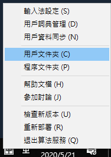

# Rime-Vietnamese-Pinyin

## Rime 越南拼音輸入法

`這是一個一言不合就動手修改輪子的自用學習越南語小工具。`

> 2020年了，既然來越南工作一年多了，總要學習下越南語。
> 雖然在工作上，都有助理翻譯會處理。
> 但自己想在電腦上輸入越南字，還是覺得很麻煩。
> 1. 越南字明明都是羅馬拼音，爲何沒有{**無廣告**}的越南拼音輸入法？
> 2. 爲何打幾個越南字，還要背鍵盤位置，學習 VNI、TELEX、VIQR 輸入法？
> 3. 還有超級難用的 Windows 內建的越南輸入法。
> 4. 常常遇到 只有拼音字元, 沒有音調的越南字...好吧, 據說越南人都看得懂, 我看不懂啊, 大哥...
>
> PS. 現在越南人平時幾乎沒在使用漢喃字 
>


## 安裝：

### Step 1. 安裝輸入法引擎：[Rime 小狼毫輸入法](https://rime.im/)

   爲什麼選擇 Rime ? **1.無廣告 2.免費 3.可以修改**
   
   請按照官方網站的說明安裝吧.

### Step 2. 下載 [rime-vietnamese-pinyin](https://github.com/JaplinChen/rime-vietnamese-pinyin) 及解壓縮之後, 

   將 **4 個 .yaml copy** 到 **[Rime 的用戶文件夾]** 內, 如下圖.

   

   Copy 好之後, 按 **[重新部署]** 即可.


## 如何<u>手動</u>增加越南詞匯:


### Step 1. 將越南字詞轉成拼音字母：

   使用 Excel 整理, 便於以後增加詞匯, 可以參考 **[越南字整理.xlsx]**

   不想寫 VBA, 所以使用 **SUBSTITUTE** Function, 
   
   嗯, 很愚笨的方法

   1. **áàãảạâẩậấầăắặẳẫẵằ** –> a,  儲存格 F1 的公式如下:

   ```
   =SUBSTITUTE(SUBSTITUTE(SUBSTITUTE(SUBSTITUTE(SUBSTITUTE(SUBSTITUTE(SUBSTITUTE(SUBSTITUTE(SUBSTITUTE(SUBSTITUTE(SUBSTITUTE(SUBSTITUTE(SUBSTITUTE(SUBSTITUTE(SUBSTITUTE(SUBSTITUTE(SUBSTITUTE(A1,"á","a"),"à","a"),"ã","a"),"ả","a"),"ạ","a"),"â","a"),"ẩ","a"),"ậ","a"),"ấ","a"),"ầ","a"),"ă","a"),"ắ","a"),"ặ","a"),"ẳ","a"),"ẫ","a"),"ẵ","a"),"ằ","a")
   ```

   2. **éèêễểẽẻẹệếề** –> e,  儲存格 G1 的公式如下:

   ```
   =SUBSTITUTE(SUBSTITUTE(SUBSTITUTE(SUBSTITUTE(SUBSTITUTE(SUBSTITUTE(SUBSTITUTE(SUBSTITUTE(SUBSTITUTE(SUBSTITUTE(SUBSTITUTE(F1,"é","e"),"è","e"),"ê","e"),"ễ","e"),"ể","e"),"ẽ","e"),"ẻ","e"),"ẹ","e"),"ệ","e"),"ế","e"),"ề","e")
   ```

   3. **íìỉịĩ** –> i,  儲存格 H1 的公式如下:

   ```
   =SUBSTITUTE(SUBSTITUTE(SUBSTITUTE(SUBSTITUTE(SUBSTITUTE(G1,"í","i"),"ì","i"),"ỉ","i"),"ị","i"),"ĩ","i")
   ```

   4. **óớòờôốồổõỏơởợọộỡỗ** –> o,  儲存格 I1 的公式如下:

   ```
   =SUBSTITUTE(SUBSTITUTE(SUBSTITUTE(SUBSTITUTE(SUBSTITUTE(SUBSTITUTE(SUBSTITUTE(SUBSTITUTE(SUBSTITUTE(SUBSTITUTE(SUBSTITUTE(SUBSTITUTE(SUBSTITUTE(SUBSTITUTE(SUBSTITUTE(SUBSTITUTE(SUBSTITUTE(H1,"ó","o"),"ớ","o"),"ò","o"),"ờ","o"),"ô","o"),"ố","o"),"ồ","o"),"ổ","o"),"õ","o"),"ỏ","o"),"ơ","o"),"ở","o"),"ợ","o"),"ọ","o"),"ộ","o"),"ỡ","o"),"ỗ","o")
   ```

   5. **úứùừũủưữửựụ** – u,  儲存格 J1 的公式如下:

   ```
   =SUBSTITUTE(SUBSTITUTE(SUBSTITUTE(SUBSTITUTE(SUBSTITUTE(SUBSTITUTE(SUBSTITUTE(SUBSTITUTE(SUBSTITUTE(SUBSTITUTE(SUBSTITUTE(I1,"ú","u"),"ứ","u"),"ù","u"),"ừ","u"),"ũ","u"),"ủ","u"),"ư","u"),"ữ","u"),"ử","u"),"ự","u"),"ụ","u")
   ```

   6. **ýỳỹỷỵ** –> y

   ```
   =SUBSTITUTE(SUBSTITUTE(SUBSTITUTE(SUBSTITUTE(SUBSTITUTE(J1,"ý","y"),"ỳ","y"),"ỹ","y"),"ỷ","y"),"ỵ","y")
   ```

   

### Step 2. 修改

   將新增的詞匯, 依照 **vn.dict.yaml** 和 **vn_han.dict.yaml** 格式, 

   按照上面 **[安裝 Step 2]** 的步驟, 打開文件夾和檔案+貼上, **[重新部署]** 即可.


### 參考：

1. 越南詞匯來源：
   1. [越南常用字 7184 字](https://gist.github.com/hieuthi/1f5d80fca871f3642f61f7e3de883f3a) 保留 Telex, 並增加拼音
   2. 網路上找到+整理的 越南語基本詞匯3600.xlsx
2. 修改自 [rime-vietnamese](https://github.com/gkovacs/rime-vietnamese)
3. 越南字庫基礎：[越南常用字 7184 字](https://gist.github.com/hieuthi/1f5d80fca871f3642f61f7e3de883f3a)
4. [漢喃字輸入法](https://chinese.com.vn/phan-mem-viet-chu-han-nom-weasel-hannom-mien-phi.html)
5. 詞匯整理: 越南字整理.xlsx
