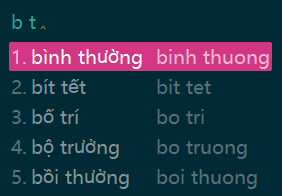
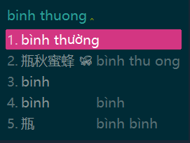
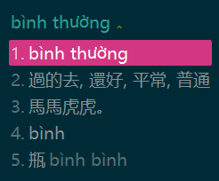
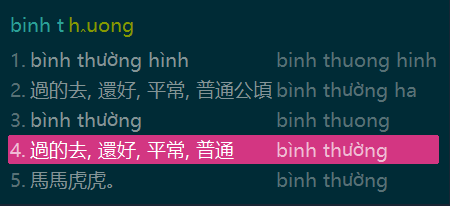
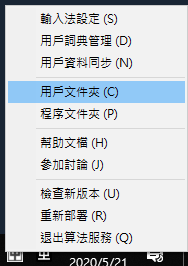
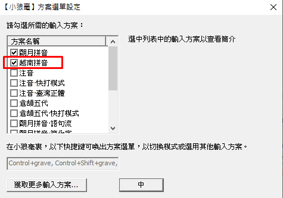
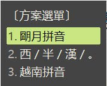
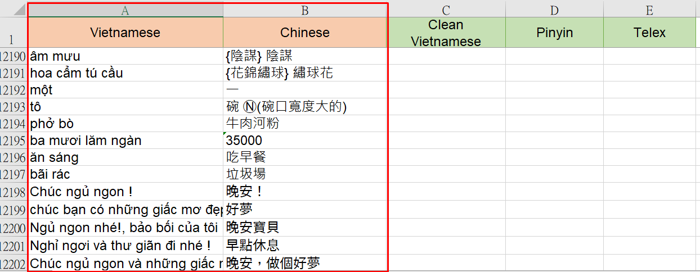
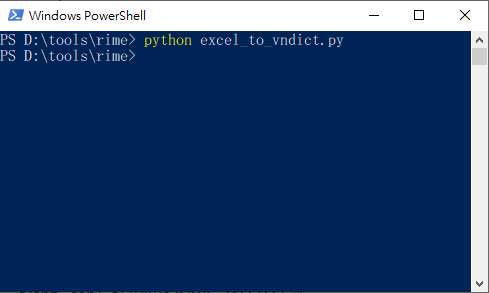

# Rime-Vietnamese-Pinyin

## Rime 越南拼音輸入法

`這是一個一言不合就動手修改輪子的自用學習越南語小工具。`

> **以下的嘮叨，請省略。**
>
> *2020年了，既然來越南工作一年多了，總要學習下越南語。*
> *雖然在工作上，都有助理翻譯會處理。*
> *但自己想在電腦上輸入越南字，還是覺得很麻煩。*
> 
>1. *越南字明明都是羅馬拼音，爲何沒有 {**無廣告**} 的 越南拼音輸入法？*
> 
>2. *打幾個越南字，還要背鍵盤位置，學習 VNI、TELEX、VIQR 輸入法？*
> 
>   *or 網頁的輸入法 + COPY + 切換軟件貼上 ?*
> 
>3. *還有超級難用的 Windows 內建的越南輸入法。*
> 
> 4. *常常遇到 只有拼音字元, 沒有音調的越南字...*
>     *好吧, 據說越南人都看得懂, 我看不懂啊, 大哥...*
> 
>*PS. 現在越南人平時幾乎沒在使用漢喃字* 

## 目的：

1. **無廣告 + 免費 + 可以自己增加詞彙**

2. 可以使用 **拼音首碼**、**拼音**、**Telex** 輸入越南字。

    **拼音首碼**

       

    **拼音**

       

    **Telex** 

       

    

3. 拼音輸入時，可以查詢整理過的越南詞彙(中文 越文)。使用 <kbd>&#8592;</kbd> <kbd>&#8594;</kbd> 切換顯示頁面，如下圖。

       

      

4. 如果使用 Telex 輸入，可以直接顯示詞彙的中文意義。

    

   

5. Telex 輸入方式，可以參考【越南阿旺】的介紹

   [【一定要會】越南Telex輸入法，手機上輕鬆輸入標準越南文](http://chanywang.blogspot.com/2014/07/telex.html)

## 安裝：

### Step 1. 安裝輸入法引擎：[Rime 小狼毫輸入法](https://rime.im/)

- 爲什麼選擇 Rime ? **1.無廣告 2.免費 3.可以修改**

- 可以切換爲中文輸入法。如 注音、拼音、…。

- 安裝方式：請按照官方網站的詳細說明，下載+安裝吧。

  

### Step 2. 增加此[越南拼音輸入法](https://github.com/JaplinChen/rime-vietnamese-pinyin) 

1. 下載 [rime-vietnamese-pinyin](https://github.com/JaplinChen/rime-vietnamese-pinyin) 及解壓縮。
2. 將 **4 個 .yaml copy** 到 **[Rime 的用戶文件夾]** 內, 如下圖.

2. Copy 好之後, 按 **[重新部署]** 即可.

    - 在「**輸入法設定**」中，可以選擇各種中文輸入法。
    
    - 紅色框是此方案「**越南拼音**」輸入法。
       
   
       
       
    - 切換輸入法：<kbd>Ctrl</kbd> + <kbd>~</kbd>
    
       

   

## 如何新增詞匯整理到 Rime: 

1. 將平日從網路上學習 or 整理的越南字詞, 儲存在 **[make_dict\VietnameseWordList.xlsx](make_dict\VietnameseWordList.xlsx)**。

   PS、只需要更新 A :Vietnamese 和 B :Chinese 欄位即可。C、D、E 內容會自動產生。
   

2. 可使用 [excel_to_vndict.py](excel_to_vndict.py) 將 **[VietnameseWordList.xlsx](make_dict\VietnameseWordList.xlsx)** 的越南字詞，重新產生 **vn.dict.yaml** 和 **vn_han.dict.yaml。**

   **`python excel_to_vndict.py`**

   

3. 再將 **vn.dict.yaml** 和 **vn_han.dict.yaml** 這二個檔案，如**安裝->Step2** copy 到 **[Rime 的用戶文件夾]** 內。

4. Rime **重新部署**。

   

### 參考：

1. 越南詞匯來源：
   1. [越南常用字 7184 字](https://gist.github.com/hieuthi/1f5d80fca871f3642f61f7e3de883f3a) 保留 Telex, 並增加拼音
   2. 網路上找到+整理的 [越南語基本詞匯3600.xlsx](越南語基本詞匯3600.xlsx)
2. 架構：Rime +  [rime-vietnamese](https://github.com/gkovacs/rime-vietnamese)
3. 越南字庫基礎：[越南常用字 7184 字](https://gist.github.com/hieuthi/1f5d80fca871f3642f61f7e3de883f3a)
4. [漢喃字輸入法](https://chinese.com.vn/phan-mem-viet-chu-han-nom-weasel-hannom-mien-phi.html)
5. [【一定要會】越南Telex輸入法，手機上輕鬆輸入標準越南文](http://chanywang.blogspot.com/2014/07/telex.html)

