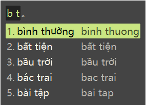
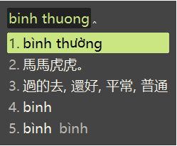
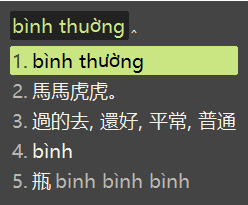
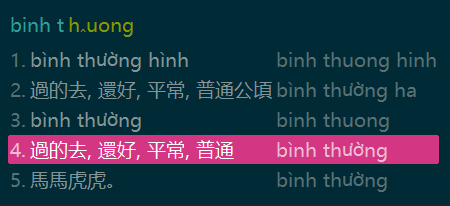
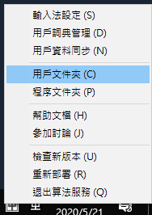
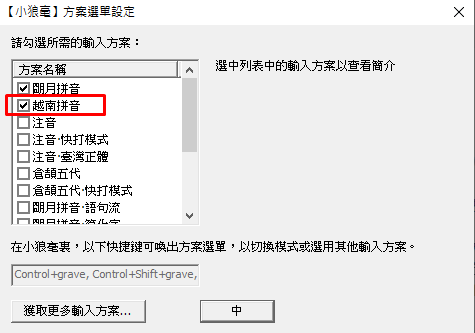
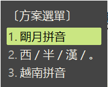
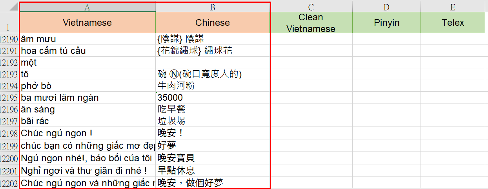
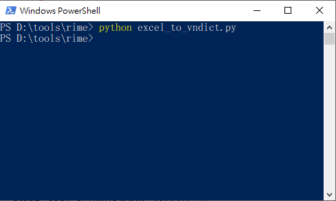

# Rime 越南語拼音輸入法

[](https://github.com/JaplinChen/rime-vietnamese-pinyin/actions/workflows/ci.yml)

## 功能

這是一套給 Rime 使用的越南語輸入方案，支援下列輸入方式：

1. 拼音首碼

   

2. 拼音

   

3. Telex

   

拼音輸入時，可以查詢整理過的越南詞彙與中文對照。候選頁面可用 <kbd>←</kbd>、<kbd>→</kbd> 切換。



Telex 輸入方式可參考「越南阿旺」的介紹：[【一定要會】越南 Telex 輸入法，手機上輕鬆輸入標準越南文](http://chanywang.blogspot.com/2014/07/telex.html)。

## 安裝

### 1. 安裝 Rime 小狼毫輸入法

先從 [Rime 官方網站](https://rime.im/) 下載並安裝輸入法引擎。Rime 免費、無廣告，也可以自行修改輸入方案。

### 2. 安裝本輸入方案

1. 下載或複製本專案。
2. 將根目錄的 4 個 YAML 檔複製到 Rime 用戶資料夾：
   - `vn.schema.yaml`
   - `vn.dict.yaml`
   - `vn_han.schema.yaml`
   - `vn_han.dict.yaml`

   

3. 在 Rime 選單按「重新部署」。
4. 在「輸入法設定」中選擇「越南拼音」。



切換輸入法可使用 <kbd>Ctrl</kbd> + <kbd>~</kbd>。



## 重新產生字典

詞彙來源檔是 [make_dict/VietnameseWordList.xlsx](make_dict/VietnameseWordList.xlsx)。平常只需要更新：

- A 欄：越南語詞彙
- B 欄：中文說明

C、D、E 欄會由腳本自動產生。



第一次執行前，先安裝 Python 依賴：

```powershell
python -m pip install -r make_dict\requirements.txt
```

重新產生字典：

```powershell
python make_dict\excel_to_vndict.py
```

腳本會更新：

- `make_dict/vn.dict.yaml`
- `make_dict/vn_han.dict.yaml`
- `make_dict/VietnameseWordList.xlsx` 的 C、D、E、F 欄

確認結果後，再將 `make_dict/vn.dict.yaml` 與 `make_dict/vn_han.dict.yaml` 複製到 Rime 用戶資料夾，或同步到專案根目錄後重新部署 Rime。

如果要同時更新專案根目錄的發布用字典，可加上 `--sync-root`：

```powershell
python make_dict\excel_to_vndict.py --sync-root
```

重建後可執行驗證，確認根目錄與 `make_dict` 內的字典一致，且每筆字典資料格式正確：

```powershell
python make_dict\validate_dicts.py
```

也可以執行完整檢查，包含 Python 腳本語法、字典格式與輔助腳本缺來源檔時的保護行為：

```powershell
python make_dict\verify.py
```

Windows PowerShell 也可以使用包裝腳本執行同一套檢查：

```powershell
powershell -ExecutionPolicy Bypass -File make_dict\verify.ps1
```

GitHub Actions 也會在 Windows 與 Ubuntu 執行同一套完整檢查。

## 詞彙表 Web UI

如果要用瀏覽器維護詞彙表，可啟動本地 Web UI：

```powershell
python make_dict\web_ui.py --port 8765
```

開啟 `http://127.0.0.1:8765` 後可進行：

- 搜尋、篩選、編輯、新增詞彙。
- 清空沒有可靠中文翻譯的中文欄；這只會清除 B 欄，不會刪除越南語詞條。
- 匯入 TypeTwo 相容的 JSON，或匯入 `越南語<Tab>中文` TSV；可選合併匯入，或先清空中文欄後取代匯入。空檔案或沒有有效詞彙的 TSV 會被拒絕。
- 匯出目前有中文翻譯的詞彙為 JSON 或 TSV。
- 產生並同步 `vn.dict.yaml`、`vn_han.dict.yaml`。
- 執行字典驗證並下載產生後的 YAML。

Web UI 每次寫入 `VietnameseWordList.xlsx` 前，會先在 `make_dict/backups/` 建立一份備份；備份檔不納入 Git。

如果要把完全重複的字典行也視為錯誤，可使用嚴格模式：

```powershell
python make_dict\validate_dicts.py --strict-duplicates
```



## 反查依賴

主要輸入方案依賴 `terra_pinyin.extended` 與 `stroke`。`vn_han.schema.yaml` 另外保留部分漢字、日文、韓文反查設定，會引用 `hanPS`、`nihongo-hybrid`、`hangyl` 等外部字典；如果本機沒有這些字典，相關反查功能可能無法使用。

只需要越南語拼音與 Telex 輸入時，根目錄 4 個 YAML 檔即可使用核心功能。

## 詞彙來源與參考

1. [越南常用字 7184 字](https://gist.github.com/hieuthi/1f5d80fca871f3642f61f7e3de883f3a)：保留 Telex，並增加拼音。
2. [make_dict/越南語基本詞匯3600.xlsx](make_dict/越南語基本詞匯3600.xlsx)
3. [rime-vietnamese](https://github.com/gkovacs/rime-vietnamese)
4. [漢喃字輸入法](https://chinese.com.vn/phan-mem-viet-chu-han-nom-weasel-hannom-mien-phi.html)
5. [vietnamese-stopwords](https://github.com/stopwords/vietnamese-stopwords/blob/master/vietnamese-stopwords.txt)：已整理部分詞彙。
